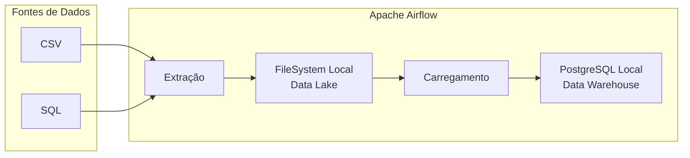
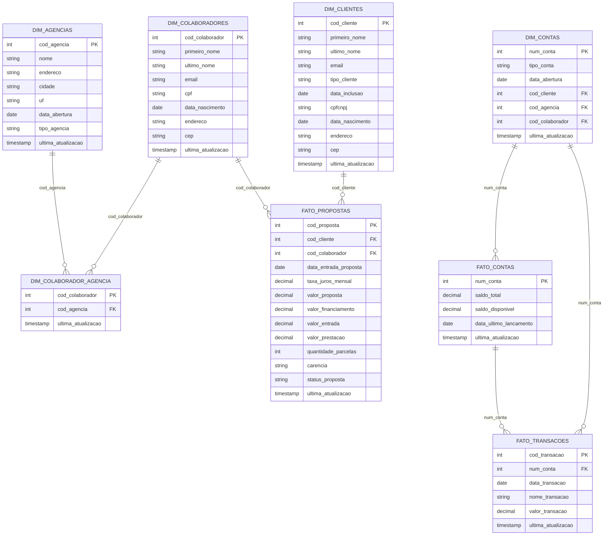

# 💚 Case Indicium - Programa Lighthouse

## 📋 Sobre o Projeto

Este repositório contém o código da minha solução para o desafio técnico do **Programa Lighthouse** da empresa **Indicium**, focado em Engenharia de Dados. O projeto demonstra a implementação de um pipeline completo de dados: extração dos dados do banco relacional do cliente Banco Vitória, modelagem dimensional de um Data Warehouse e ingestão dos dados no mesmo.

### 🎯 Objetivo
Desenvolver uma solução de dados focada em **extração e ingestão** que demonstre competências técnicas em:
- Engenharia de Dados
- Modelagem Dimensional
- Pipeline ETL
- Data Warehouse
- Orquestração de processos com Apache Airflow
  
---

## 🏗️ Arquitetura do Projeto

### Diagrama de Fluxo de Dados

---

## 🗄️ Modelagem do Data Warehouse

### Diagrama de Relacionamento

---

## 🛠️ Tecnologias Utilizadas

- **Docker** - Containerização da aplicação e dependências
- **Apache Airflow** - Orquestração e agendamento de pipelines
- **PostgreSQL** - Banco de dados para Data Warehouse
- **Python** - Linguagem principal para ETL e processamento
- **SQL** - Manipulação e consulta de dados
  
---

## 📊 Pipeline de Dados

### Funcionalidades Implementadas:
- **Extração automatizada** de dados de múltiplas fontes
- **Armazenamento** de dados brutos em um Data Lake
- **Carregamento estruturado** no Data Warehouse PostgreSQL
- **Orquestração com Airflow** para agendamento e monitoramento
- **Modelagem dimensional** para análises otimizadas

---

## ⚠️ Limitações Conhecidas

Este projeto foi desenvolvido para fins de **demonstração técnica** e possui as seguintes limitações:

### 🔴 Data Lake Simulado
- Utiliza sistema de arquivos local para simular um Data Lake em vez de uma solução cloud (AWS S3, Azure Data Lake, etc.)

### 🔴 Ausência de CDC (Change Data Capture)
- Os dados mais atualizados são determinados de acordo com a data do diretório do Data Lake
- Não captura mudanças em tempo real 
- Dados podem ficar desatualizados entre execuções

### 🔴 Ambiente de Desenvolvimento
- Configuração simplificada para demonstração
- Execução em containers locais via Docker
- Sem pipeline CI/CD implementado
- Logs e monitoramento básicos

---

## 🎯 Melhorias Futuras

Para uma implementação em produção, seria necessário:

1. **Implementar CDC** para captura de mudanças em tempo real
2. **Migrar para Data Lake real** (AWS S3, Azure Data Lake, GCP Cloud Storage)
3. **Adicionar orquestração avançada** com recursos enterprise do Airflow
4. **Implementar data quality** e validações automáticas robustas
5. **Adicionar monitoramento** e alertas avançados
6. **Configurar pipeline CI/CD** para automação de deploys
7. **Implementar data lineage** e catalogação de dados
8. **Adicionar testes automatizados** para os pipelines
9. **Configurar backup e recovery** dos dados
10. **Implementar segurança** e controle de acesso

---

## 👥 Contato

**Juliana Vieira**
- LinkedIn: [linkedin.com/in/juliana-vieira](https://linkedin.com/in/juliana-vieira)
- Email: julianasalustianovieira@gmail.com

---

*Projeto desenvolvido com 💚 para o Programa Lighthouse 2025*
