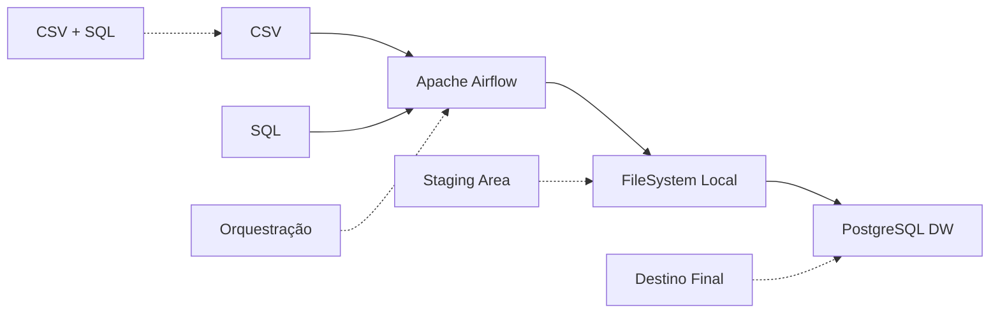
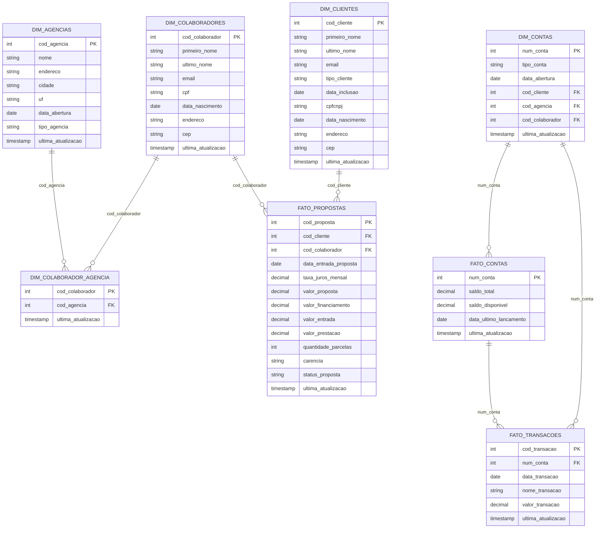

# 💚 Case Indicium - Programa Lighthouse

## Descrição do Projeto

Este repositório contém a solução para o case técnico de Engenharia de Dados do Banco Vitória (BanVic), que simula a implementação de um pipeline de dados para centralizar informações de diferentes fontes em um Data Warehouse.

O projeto aborda a jornada de maturidade de dados do BanVic, focando inicialmente na análise de dados de crédito como projeto piloto para demonstrar valor para a organização.

### Contexto do Desafio

O Banco Vitória S.A. (BanVic) busca evoluir sua cultura de dados através da implementação de um pipeline de dados que centralize informações em um Data Warehouse. Atualmente, as análises são realizadas manualmente em planilhas, o que limita a capacidade de geração de insights para tomada de decisão.
  
---

## Arquitetura da Solução

---

## Modelagem do Data Warehouse

---

### Funcionalidades Implementadas

- Orquestração com Apache Airflow: Pipeline gerenciado e agendado

- Extração Idempotente: Processos reprodutíveis e consistentes

- Extração em Paralelo: CSV e SQL processados simultaneamente

- Padronização de Arquivos: Estrutura de diretórios organizada

- Carregamento Condicional: DW só é atualizado se ambas extrações forem bem-sucedidas

- Agendamento Automático: Execução diária às 04:35

- Ambiente Reproduzível: Configuração via Docker Compose
  
---

## Limitações Conhecidas

Este projeto foi desenvolvido para fins de **demonstração técnica** e possui as seguintes limitações:

### Data Lake Simulado
- Utiliza sistema de arquivos local para simular um Data Lake em vez de uma solução cloud (AWS S3, Azure Data Lake, etc.)

### Ausência de CDC (Change Data Capture)
- Os dados mais atualizados são determinados de acordo com a data do diretório do Data Lake
- Não captura mudanças em tempo real 
- Dados podem ficar desatualizados entre execuções

### Ambiente de Desenvolvimento
- Configuração simplificada para demonstração
- Execução em containers locais via Docker
- Sem pipeline CI/CD implementado
- Logs e monitoramento básicos

---

## Melhorias Futuras

Para uma implementação em produção, seria necessário:

1. **Implementar CDC** para captura de mudanças em tempo real
2. **Migrar para Data Lake real** (AWS S3, Azure Data Lake, GCP Cloud Storage)
3. **Implementar data quality** e validações automáticas robustas
4. **Configurar pipeline CI/CD** para automação de deploys
5. **Implementar data lineage** e catalogação de dados
6. **Adicionar testes automatizados** para os pipelines
7. **Configurar backup e recovery** dos dados
8. **Implementar segurança** e controle de acesso

---

## Contato

**Juliana Vieira**
- LinkedIn: [linkedin.com/in/juliana-vieira](https://linkedin.com/in/juliana-vieira)
- Email: julianasalustianovieira@gmail.com

---

*Projeto desenvolvido com 💚 para o Programa Lighthouse 2025*
